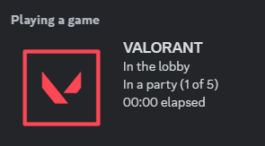
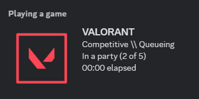
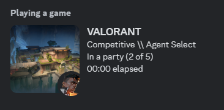
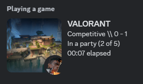

# VALORANT RPC

**A simple app that displays game details on your Discord profile.**

_This was heavily inspired by [this project](https://github.com/colinhartigan/valorant-rpc) by [@colinhartigan](https://github.com/colinhartigan). It was outdated sadly in terms of new maps and agents, and I wanted to recreate something in Javascript that was up to date_

## Provided Details:

- Score
- Agent currently playing/selecting
- Map being played on
- Gamemode (Competitive, Standard, Spike Rush, etc.)
- Time for each round
- Different states for in lobby, in game, in range, in custom game

## Installation

1. Clone this repo

```sh
git clone https://github.com/peanutdumplings/valorant-rpc.git
```

2. CD to the directory

```sh
cd valorant-rpc
```

3. Install dependencies

```sh
[npm | pnpm] install
```

4. Run the app (you must have VALORANT and Discord open)

```sh
[npm | pnpm] run start:prod
```

The app should automatically detect your VALORANT and Discord clients and accordingly set the rpc

## Examples









## Credits

[@colinhartigan](https://github.com/colinhartigan) - Original idea
[@tanishqmanuja](https://github.com/tanishqmanuja) - Valorant api client
[@techchrism](https://github.com/techchrism) - Valorant API documentation
[@discordjs](https://github.com/discordjs/RPC) - Discord RPC package

## If you have any issues please open an issue on the [GitHub page](https://github.com/PeanutDumplings/valorant-rpc/issues)
